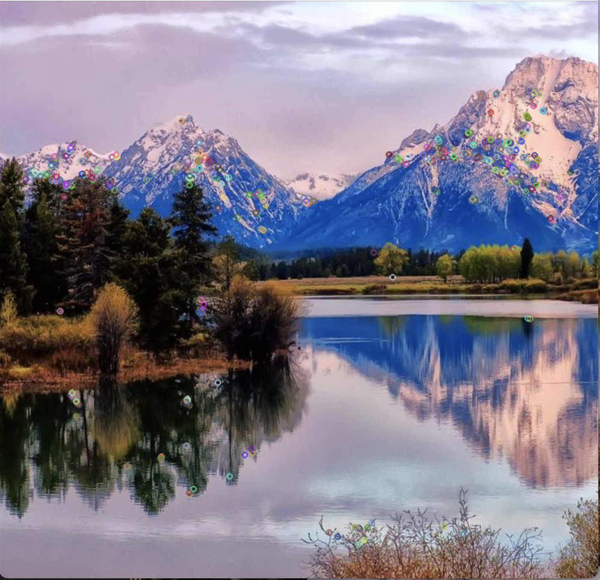

### Milestone report 

Developed by Zibo Gong (zibog) and Ziying He (ziyingh)

#### Summary
We are going to parallelize the panorama stitching using partially overlapped images on multi-core CPUs using OpenMP and on NVIDIA GPUs. We plan to take advantage of feature extractor like SIFT to implement this project.

#### Progress
We created a sequential implementation using OpenCV functions. We are in the process of changing the sequential version with our own implementations of the functions. Below are our results:  
Here are the original two images.

Here are the keypoints detected:

Here are the matched descriptors:

Here’s the resulting panorama:

#### Goal Analysis
We are doing well with respect to our goals. We believe we will still be able to produce our deliverables because we have now determined the specific places that needs to be parallized and understand the algorithm better to achieve better performance. Some nice to have would be to try out more ways for each step such as implementing both BRIEF and SIFT and comparing their performance. Our updated goals are:  
1. Fully implement sequential version  
2. Implement parallel version using OpenMP  
3. Implement parallel version using CUDA on GPU  
4. Create performance graphs and comparisons.  

#### Poster Session
We will show the separate input images and stitched output images on a poster. Intermediate process images and the performance graph will also be included. Specifically, performance graph may include speedup contrast between sequential version and parallel version, performance contrast between different cores, etc.

#### Issues and Concerns
The correctness of sequential version is very important since our parallel version depends on it. The parallel implementation using CUDA may become more challenging than we imagine.

#### Platform Choice
We will use C++ and a normal CPU for the sequential version. NVIDIA GPUs can be used for parallelization in GPU case and multi-core CPUs using OpenMP and OpenMPI are also considered. We are considering using PSC and GHC machines to carry out our project. We use these because we are familiar with them from our assignments.

#### Schedule
1. 11/22 - 11/28:  
Submit project milestone report on 11/22.  
Rewrite sequential implementation of detecting keypoints with DoG. (Ziying)  
Rewrite sequential implementation of extracting descriptors with SIFT/BRIEF.(Zibo)  
Rewrite sequential implementation of matching descriptors with Brute Force Matching.(Ziying)  
2. 11/29 - 12/2:  
Implement the OpenMP parallel version of panorama stitching on CPU and evaluate performance (e.g. speedup and correctness) with sequential version. (Ziying and Zibo)  
3. 12/3 - 12/9:  
Implement CUDA parallel version of panorama stitching on GPU and evaluate performance with OpenMP and sequential version. (Ziying and Zibo)  
Create poster.  
Submit final project.

#### Sources
<http://6.869.csail.mit.edu/fa12/lectures/lecture13ransac/lecture13ransac.pdf>
<https://itzone.com.vn/en/article/image-stitching-the-algorithm-behind-the-panorama-technology/>
<http://vision.stanford.edu/teaching/cs131_fall1718/files/07_DoG_SIFT.pdf>
