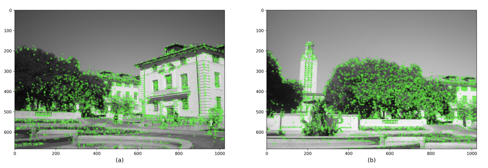
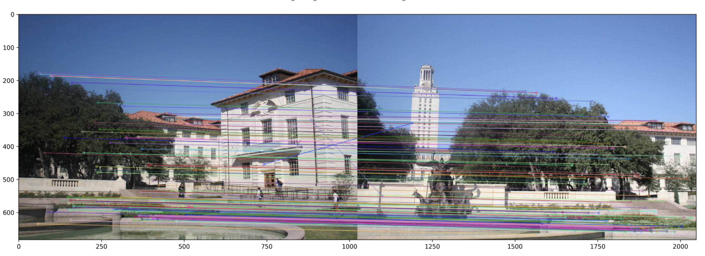

### 15418/618 Project: Parallel Panorama Stitching

Developed by Zibo Gong (zibog) and Ziying He (ziyingh)

####  URL
<https://zibog98.github.io/ParaPanoStitch/>  

#### Summary
We are going to parallelize the panorama stitching using two partially overlapped images on multi-core CPUs using OpenMP and on NVIDIA GPUs using CUDA. We plan to take advantage of SIFT key points detector and feature extractor to implement this project.

#### Background
Panorama Stitching between two images consists of steps many of which are able to be done in parallel. We use the following image as an example of the process.

1. Detect Key Points:
Key points are points of interest in the image. DoG is used to detect these key points.
2. Extract Local Invariant Descriptors:
Local invariant descriptors characterizes image content into local feature coordinates. SIFT is mainly used for this step.

3. Match Key Points and Descriptors:
Match the key points between two images using their distance. A brute force or a nearest neighbor algorithm is typically used.

4. Estimate Homography Matrix with RANSAC:
Create a homography matrix that computes the alignment between the images. RANSAC is mainly used in this step.
5. Project onto Surface and Blend Images:
Project each image onto some surface and blend them together to create the final panorama.

#### Challenge
The traditional implementation of panorama stitching is multi-staged and the whole pipeline of panoramastitching is sequential executed so parallelizing the whole procedure seems very difficult. However intuitively, parallizing some partial stage of the whole procedure may be more practical; For example, for key points matching part we can do brute force matching and therefore we can easily parallel this part since those match searching is independent from each other. Starting from parallelizing these small computing parts, we are expected to be faced with more challenges to step into how to make the procedure more parallel.
With respect to the workload, when detecting key points, the whole workload is initially two images and pixels. However those pixels can’t be regarded as independent; Taking feature detector Oriented Fast and Rotated Brief(ORB) as an example, we need to know information of 16 pixels around one pixel to filterkey points. This fact makes the parallelizing the stage harder and we may need more communication orsynchronization to implement parallel. For the latter stages, we may shift our attention on features of keypoints and it seems that we will likely face less depended workload. Implementing panorama stitching on GPU seems a more challenging part since we do need some communication and sequentially depended tasks. Methods to Map the workload to CUDA unit is something that we need to figure out.

#### Resources
OpenCV in C++ has many functions to make the algorithm simple to create. We will use that as a guideline to first create a sequential version. We will use some papers to aid us in the parallelized version.

#### Goals and Deliverables
* Plan to achieve & Hope to achieve
We plan to achieve parallel version of panorama stitching taking advantage of feature detector like SIFT. First we will utilize OpenCV libraries to implement sequential version and then we will use API like OpenMP and MPI to implement parallel version of panorama stitching on CPU or use CUDA on GPU. Besides parallizing the procedure to gain execution speedup, we also intend to obtain stitched images with good quality. We may compare our output images with our sequential output or maybe with some others’ potential open-source implementation. We plan to implement a parallel version on either platform first and if our project goes very well, we are considering implementing parallel version on both platforms.
* Demo
We will show the separate input images and stitched output images on a poster. Intermediate process images and the performance graph will also be included. Specifically, performance graph may include speedup contrast between sequential version and parallel version, performance contrast between different cores, etc.

#### Platform Choice
We will use C++ and a normal CPU for the sequential version. NVIDIA GPUs can be used for parallelization in GPU case and multi-core CPUs using OpenMP and OpenMPI are also considered. We are considering using PSC and GHC machines to carry out our project. We use these because we are familiar with them from our assignments.

#### Schedule
1. 11/3 - 11/7:  
Finish up research and background knowledge about panorama stitching;    
Understand most commonly used algorithms for each step;   
Begin sequential implementation.
2. 11/8 - 11/14:  
Finish sequential implementation;    
Stretch: Begin parallelizing step 3.
3. 11/15 - 11/21:  
Finish trying implementations of step 3 to speedup performance.   
4. 11/22 - 11/28:  
Submit project milestone report;   
Begin parallelizing step 2.
5. 11/29 - 11/5:  
Finish parallelizing step 2;   
Create overall performance graphs;   
Stretch: find other places to speedup performance.  
6. 11/6 - 11/9:  
Tidy up code;  
Create poste;   
Submit final project.

#### Sources
<https://courses.engr.illinois.edu/cs498dwh/fa2010/lectures/Lecture%2017%20-%20Photo%20Stitching.pdf>   
<https://itzone.com.vn/en/article/image-stitching-the-algorithm-behind-the-panorama-technology>    
<http://vision.stanford.edu/teaching/cs131_fall1718/files/07_DoG_SIFT.pdf>  
<https://towardsdatascience.com/image-panorama-stitching-with-opencv-2402bde6b46c>  
